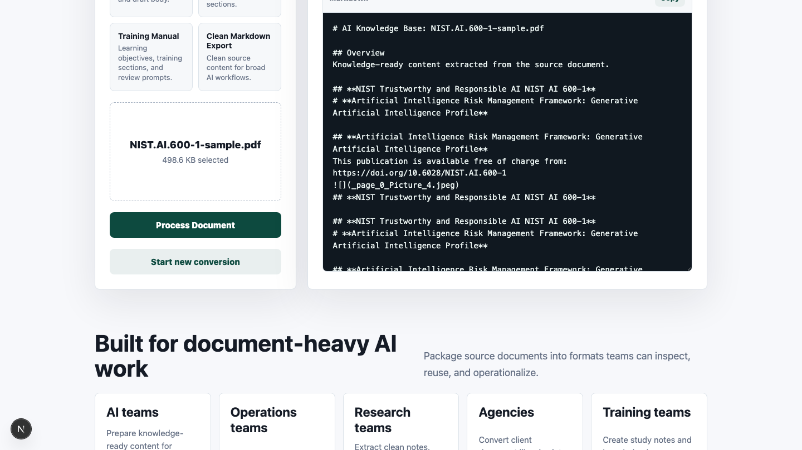
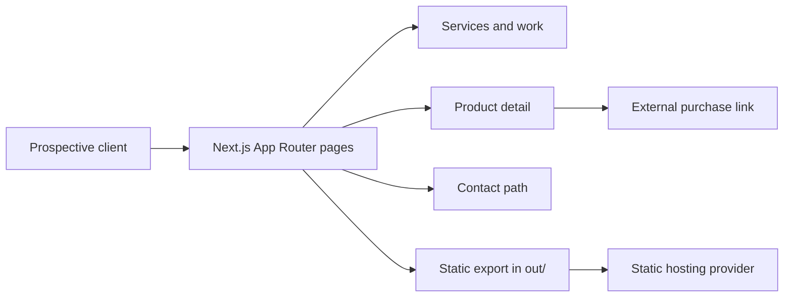

<div align="center">

# RelayWorks

### Software that removes operational drag.

**A static Next.js portfolio for an automation engineering practice focused on AI workflows, API integrations, document systems, and internal tools.**

[View the website](https://getrelayworks.com) · [Review selected work](https://getrelayworks.com/work/) · [Discuss a project](https://getrelayworks.com/contact/)

  

</div>

## Business problem

Technical portfolios often list tools without showing how those tools solve business problems. This site gives potential clients one clear route from operational pain to relevant services, inspectable project evidence, and a direct conversation.

## Key features

- Outcome-led service positioning for AI automation, integrations, and custom software
- Selected-work index linked to public, inspectable repositories
- Dedicated product page for the RelayWorks AI Document Processing Kit
- Static export with no server, database, authentication, or runtime secrets
- Responsive layouts, accessible landmarks, and project-specific metadata

## Screenshots

The repository contains verified product screenshots under [`public/images/product`](public/images/product). A refreshed portfolio-homepage capture is intentionally not committed yet; see [`docs/SCREENSHOTS.md`](docs/SCREENSHOTS.md) for the capture brief.



## Architecture



The site has no API routes or persistence layer. Content is compiled at build time and deployed as static files. See [`docs/ARCHITECTURE.md`](docs/ARCHITECTURE.md).

## Tech stack

- Next.js 16 and React 19
- TypeScript
- CSS with no UI framework dependency
- Static export for portable hosting

## Installation

Prerequisites: Node.js 20 or 22 and npm.

```bash
git clone https://github.com/DevCalebR/relayworks-website.git
cd relayworks-website
npm ci
```

## Configuration

No environment variables are required. Product purchase links use `GUMROAD_URL` in [`config/site.ts`](config/site.ts). Update `site.url` there before deploying to a different canonical domain.

## Running locally

```bash
npm run dev
```

Open the URL printed by Next.js. Verify the production path with:

```bash
npm run validate
```

## Deployment

`npm run build` creates a static site in `out/`. Deploy that directory to Cloudflare Pages, Netlify, GitHub Pages, or another static host. Provider settings are documented in [`DEPLOYMENT.md`](DEPLOYMENT.md).

## Project structure

```text
app/                 Routes, metadata, and global styles
  contact/           Client-conversation entry point
  services/          Service positioning
  work/              Selected portfolio projects
  document-processing-kit/
components/          Shared navigation and product media
config/site.ts       Canonical site and purchase configuration
public/              Product screenshots, video, and icons
docs/                Architecture, screenshots, troubleshooting
```

## Design decisions

- The homepage leads with business outcomes; technologies appear as supporting proof.
- Selected work links to code instead of presenting unsupported performance claims.
- The document-processing kit remains a distinct product within the broader studio identity.
- Static output minimizes hosting cost and removes unnecessary operational risk.

## Known limitations

- Contact currently routes through the public GitHub profile; there is no contact form or CRM integration.
- Portfolio-homepage screenshots still need to be captured after production deployment.
- Analytics uses Microsoft Clarity and should be reviewed against the deployed privacy policy.

## Roadmap

- Capture desktop and mobile portfolio screenshots after deployment
- Add concise case-study pages only when outcome evidence is available
- Add a branded social-preview image for the studio homepage

## License

Copyright © 2026 Caleb Rogers. All rights reserved. See [`LICENSE`](LICENSE).

## Work with me

RelayWorks builds AI automations, API integrations, document workflows, and focused internal tools. [Review the work](https://getrelayworks.com/work/) or [start a project conversation](https://getrelayworks.com/contact/).
